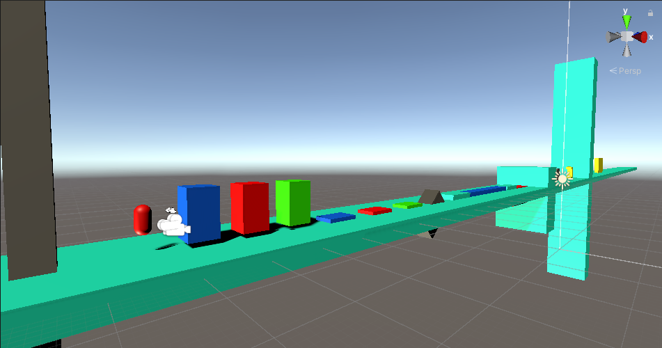
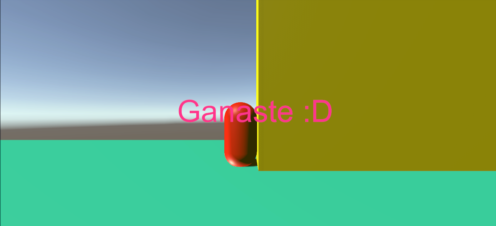
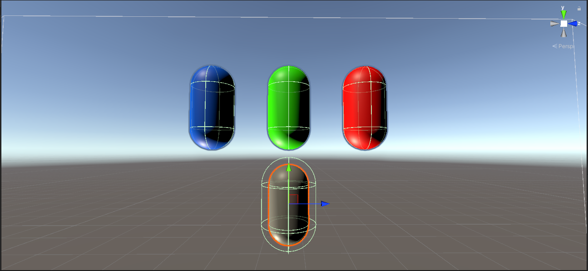
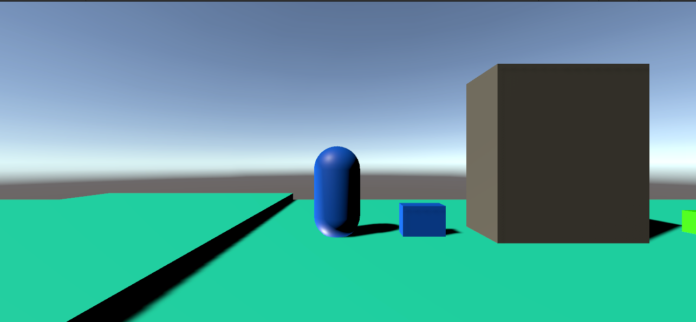

# RiniColors
Mini juego de puzzle desarrollado en Unity 2019.4.12f1, donde se debe cambiar el color de la jugadora para poder seguir avanzando por el nivel, una practica de mecanica, uso de Rigidbody pero con cinematica controlada.
---
## Scrpit Principales
-`RiniMovement.cs` -> Movimiento libre de la jugadora, desplazamiento de izquierda a derecha con salto, el movimineto se realiza en el `FixedUpdate()` utilizando `riniRB.MovePosition(riniRB.position + direction.normalized * 5 * Time.fixedDeltaTime);` para mover el RigidBody del objeto pero de forma controlada, se ve afectado por fuerzas como AddForce o Velocity, es independiente de su peso, y detecta las colisiones, aunque carece de realismo, también controlo con una bool si está tocando el suelo para habilitar o deshabilitar el salto.

-`cambio.cs` -> Su función es gestionar el cambio de "Trajes de color" de la protagonista, activando y desactivando por input y asegurandose de limitar el cambio.

-`Victoria3.cs` -> Recibe un objeto de canvas, para activar pantalla de victoria tras cumplir los requisitos.

-`BotonPress.cs` -> Forma sencilla de utilizar el editor para seleccionar, que traje activa el scrpit y que obstaculo de la escena se elimina.

-`Enemigo1.cs` -> Comportamiento sencillo de perseguir a la jugadora, y cuando se encuentra suficientemente cerca, destruirse después de unos segundos, con un pequeño estimulo visual.

---
## Objetivos
Practica del uso de etiquetas, detección de colisiones, movimiento del RigidBody pero con cinematica controlada para interactuar con el entorno, crear una mecanica divertida y visual, utilizando:

-`riniRB.MovePosition(riniRB.position + direction.normalized * 5 * Time.fixedDeltaTime);` -> Recibir el input de dirección, alterar el RigidBody del objeto, desde el FixedUpdate(), para crear un movimiento suavizado, de impactos directos, sin sentir temblores o vibracions indeseadas. No hay un rebote o empuje fisicamente, y se puede manejar de forma controlada con un AddForce. Es independiente del peso del objeto.

-`public void OnCollisionEnter(Collision collision) { if (collision.gameObject.CompareTag("Suelo")) } ` -> Detectar desde el objeto, que tiene un area que funciona de hitbox, si está tocando el suelo para habilitar el salto.

-`Time.timeScale = 0;` -> Pausa la actividad de la escena y permite generar un efecto en la pantalla de carga sobre puesta.

-`RiniRb.transform.localScale = new Vector3(RiniRb.transform.localScale.x, RiniRb.transform.localScale.y / 2, RiniRb.transform.localScale.z);` -> Pequeño efecto visual para simular un botón precionado cambiando la escala del objeto.

-`objetivo = GameObject.Find("Rini");` -> Busqueda del "Rini" como tag en la escena, sencible a fallos.

-`Destroy(gameObject,num);` -> Destrucción controlada, después de num Segundos.

---
## Versión Jugable
[Disponible en Itch.io] https://rhifumi.itch.io/mininitestrinicolors

---
## Capturas

